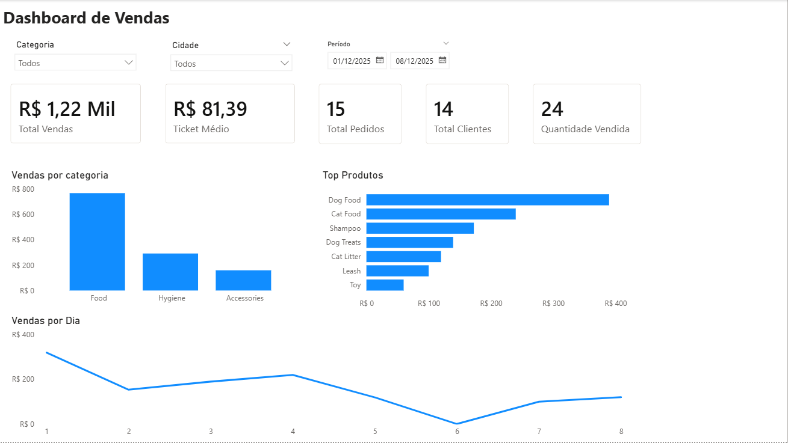

# Dashboard de Vendas (Power BI + PostgreSQL + Python)

Projeto de análise de vendas com pipeline simples de dados, usando **Python** para tratamento, **PostgreSQL** para armazenamento e **Power BI** para visualização.

## Objetivo
Construir um dashboard de vendas com indicadores principais e filtros para análise por **categoria**, **cidade** e **período**.

## Dashboard (Power BI)
O dashboard contém:

- **KPIs**
  - Total de Vendas
  - Ticket Médio
  - Total de Pedidos
  - Total de Clientes
  - Quantidade Vendida

- **Gráficos**
  - Vendas por Categoria
  - Top Produtos (por Vendas)
  - Vendas por Dia

- **Filtros**
  - Categoria
  - Cidade
  - Período

## Preview do Dashboard




## Estrutura do Projeto
```
data/
    raw/ dados brutos
    processed/ dados tratados
    dashboard/ arquivo .pbix do Power BI
    sql/ queries SQL
    src/ scripts Python
    README.md
    requirements.txt
```  


## Tecnologias utilizadas
- Python
- Pandas
- PostgreSQL
- SQL
- Power BI

## Como rodar o projeto
### 1) Instalar dependências
```bash
pip install -r requirements.txt
